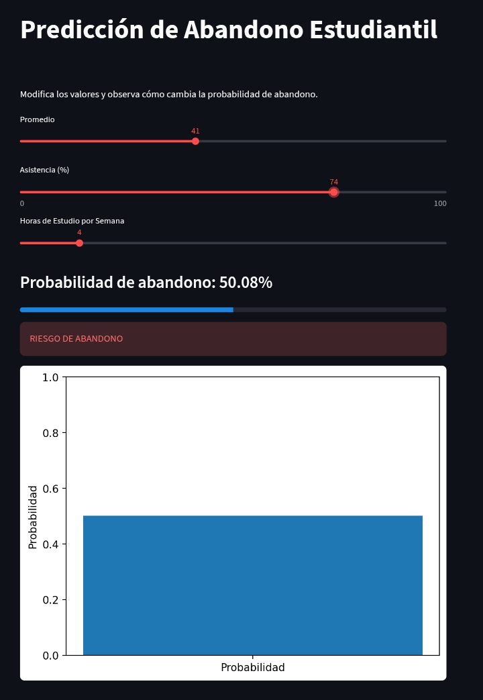

# Proyecto MAT205 - Regresión Logística
## Descripción
Este proyecto implementa un modelo de Regresión Logística para predecir el riesgo de abandono estudiantil.
## Dependencias
pip install -r requirements.txt
## Ejecución
Entrenar el modelo:
py train_model.py
Ejecutar la aplicación:
py -m streamlit run app.py
## Uso
Modificar los valores de entrada para obtener una predicción del riesgo de abandono estudiantil.
Ingresando al link : https://proyecto-regresion-logisticamat205-ycew6c9vjyxkbt6nofykjf.streamlit.app/
## Captura de la Aplicación

## Autor
Kevin Miranda Arancibia
Ingeniería de Sistemas
MAT205
